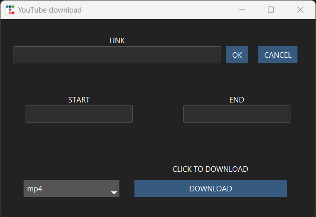

# Youtube-cutter

This is a desktop application that permits the download of youtube videos in a mp3 or a mp4 format. You can also choose timestamps to cut a sequence from that video.
The GUI was done with Tkinter (and ttkbootstrap) and the downloading and cutting are performed using yt-dlp and ffmepg respectively.

  

You copy paste the link of the Youtube video you want to download in the LINK entry and you then push OK. You should see the timestamps of the beginning and the end of the video appear in the START and END entry. If you want to download the whole video, you just have to keep these timestamps the same and click on download. You should see on your terminal that yt-dlp is working. 
To cut a sequence, you must modify the timestamps while keeping the exact initial format. The video will be downloaded in your working repository with the name of the video followed by the times at which the video was cut. The whole video will be downloaded regardless, in case there needs to be multiple cuts applied.

The button CANCEL will erase all fields.

There may be some errors due to yt-dlp although the commands in the python script are correct. Nothing some stackoverflowing could not resolve.
